# _Culicoides_ML_

# 2025 Internship subject: **Spatio-temporal modeling of Culidcoides populations in France using Machine Learning**

## INFORMATION
- `/updated_scripts`
    **Directory containing UPDATED work: scripts, model outputs and interpretation**
- `/scripts`
    **Directory containing NOT UPDATED scripts for data preparation, Cross-Correlation Mapping and multivariate analysis**
- `/datapaper_viz`
    **Directory containing ocapi database basic visualizations (histograms, boxplots)**
## DESCRIPTION
The primary goal is to create presence and absence models with two uses:
1) Prediction of Culicoides populations in France in the past, present and future using available climatic data
2) Interpretation and explanation of the model outputs : 
-   Which factors lead to an earlier start of the *Culicoides sp.* activity season? 
-   Which factors contribute to increased *Culicoides sp.* abundance?

## Where does the data come from?
**During 2009 - 2012, biting midges, the blue tongue and Epizootic hemorrhagic disease vector species, were captured using UV light traps in metropolitan France. 
- 1-2 traps per department
- Around 160 traps deployed each year
- A total of 14895 trapping sessions 
- Species, landscape and microclimatic data collected

**Map of biting midge trap locations and Ecoclimatic Zones**

**For model construction with spatial cross-validation, the data was separated into cells with a 150 km x 150 km grid.**
**Map of biting midge trap locations and Ecoclimatic Zones**
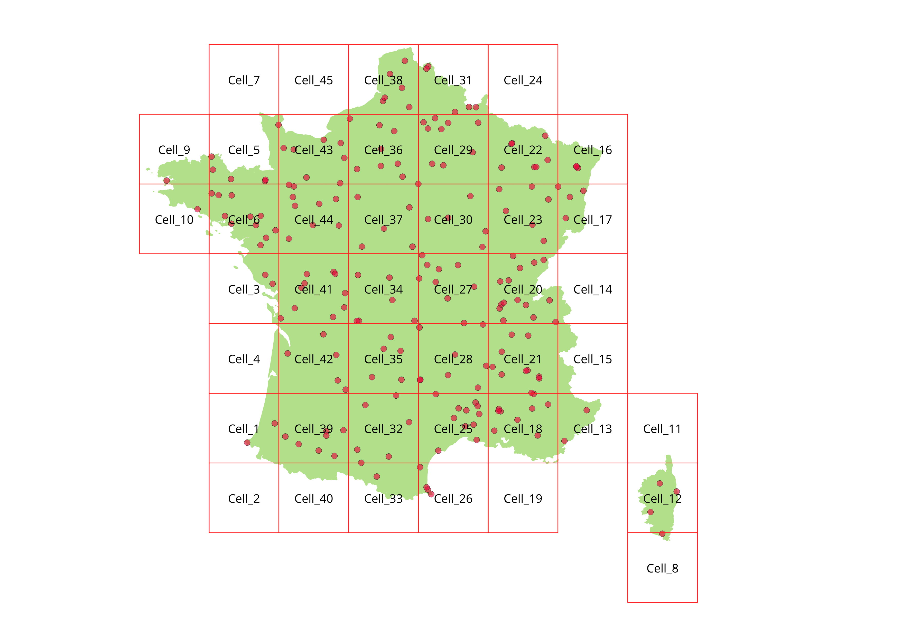

## VARIABLE SELECTION
**
 <mark>1. Meteorological data </mark>** 

**Presence/Absence model Cross-Correlation Map (CCM) for distance**
Brighter red values indicate higher correlation.
Lighter values indicate weak correlation.
Grey values indicate No correlation.
Red bordered squares are the most correlated values, whereas black bordered squares are at least 90% correlated as the highest correlated value.
*NOTE : Distance CCM indicate the strength of the association, but not the direction!*
*Direction of the association can be better indicated using Spearman's correlation* [Not included here.]

Local landscape and microclimatic variables were selected using general linear mixed models, with a traditional significance threshold of  p  < 0.05.

**Potential features for the Presence/Absence model which are significantly associated with the response (presence)**

*However, using a heatmap, we can see that a lot of them are highly correlated between each other:*
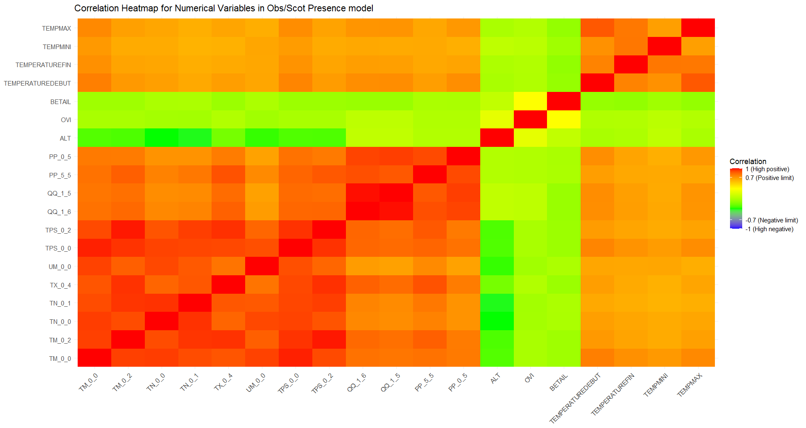

Final variable selection was done selecting biologically important features with < 0.7 correlation between in a pairwise comparison:
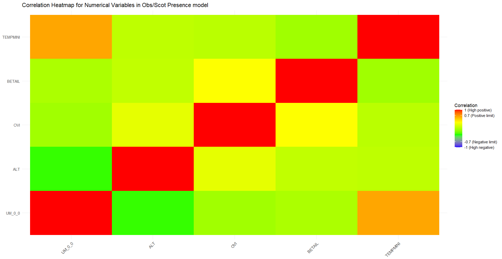

**Categorical features (wind strength, type of farm) were tested for correlation with Fisher's Exact test and Cramer's V, investigating the strength of their association between each other [Not included here.]

## VISUALISATION
**
 <mark>1. Presence model output </mark>** 

**C. obsoletus/scoticus predicted vs observed presence 2009-2012 with Leave-Time-Out (LTO) Cross Validation**
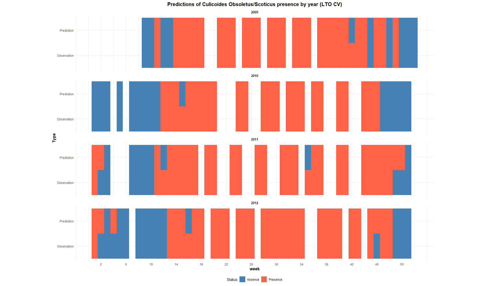

**With Ecolimatic zones**

-----------------------------------
**C. obsoletus/scoticus predicted presence probability 2009-2012 with LTO CV**

**Comparing Leave-Location-Out and Leave-Time-Out CV predictions**

-----------------------------------
**
 <mark>2. Model evaluation </mark>** 

 
**Area Under the ROC CURVE comparing LLO and LTO model performance across different ecoclimatic zones and France**
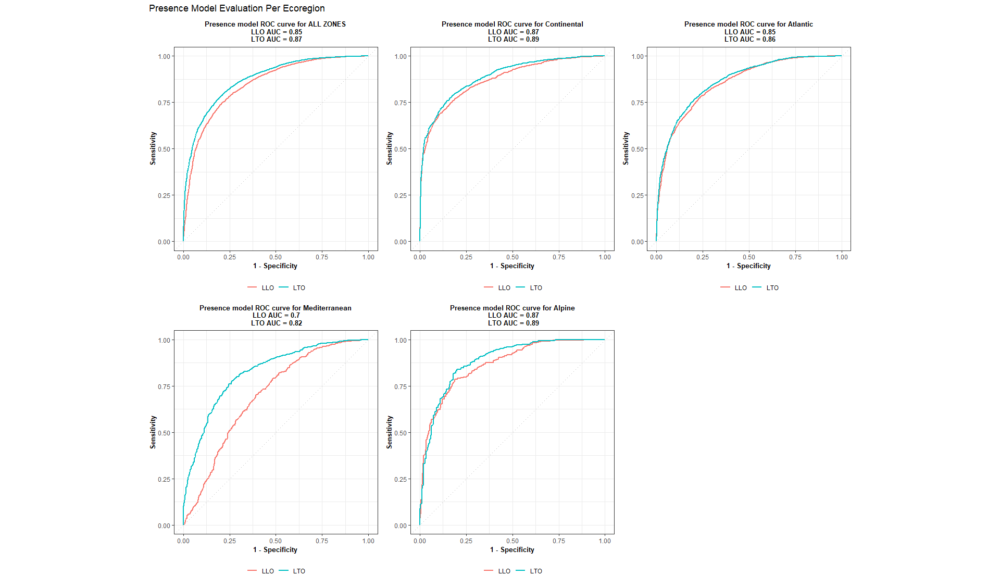

**Average prediction error in weeks for LLO and LTO models**
If error > 0, model predicts too late;
if error < 0, model predicts too early

**Variable Importance with categories**
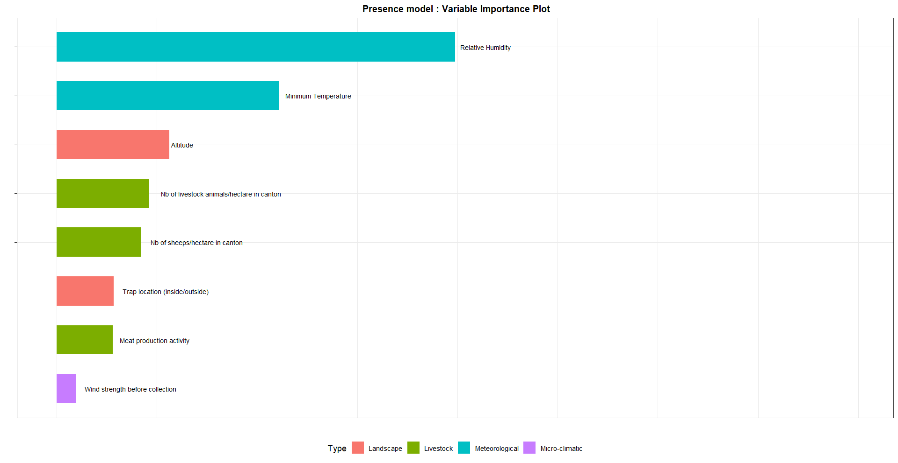

**Scaled  Variable Importance**
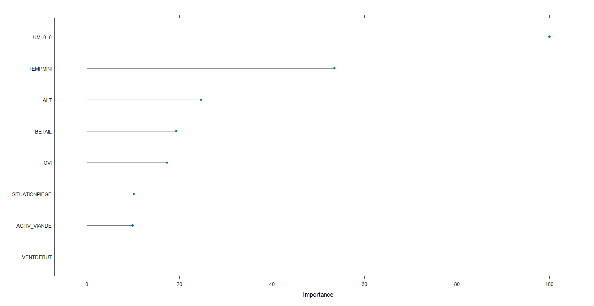

**Partial Dependence Plots (PDP)**
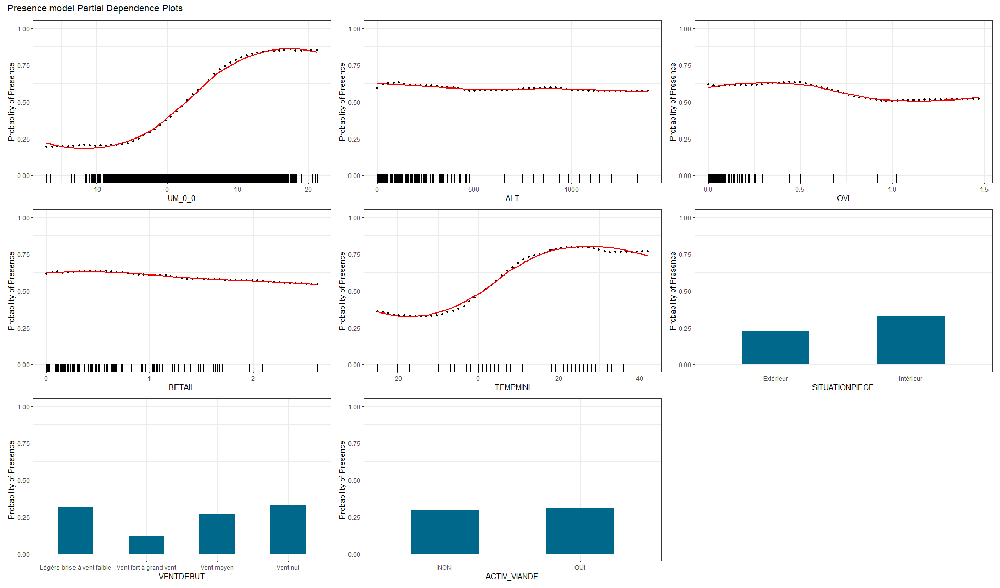

-----------------------------------
**
 <mark>3. Variable Interaction analysis</mark>** 

**Centered Individual Conditional Expectation plots (ICE-c).**
Displays how each prediction changes when varying one predictor while keeping all other features fixed.
Red line is the mean trend across all predictions.

*By separating different ecoclimatic regions, we see that the response to differing predictor values is heterogenous for each instance (i.e. for each prediction), indicating that some feature interaction.
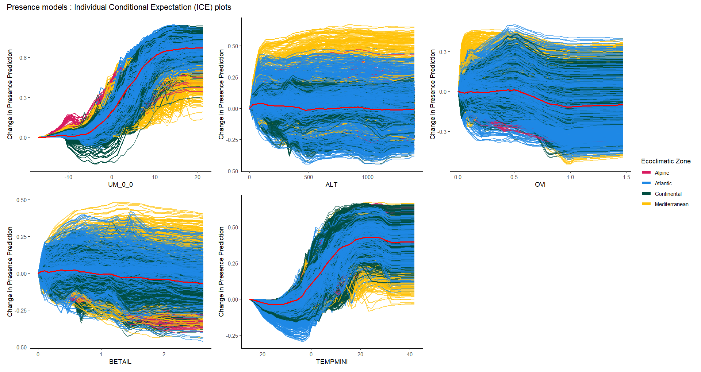

**Feature interaction can be investigated through the H-statistic, which ranges from 0 - 1.**
0 = no feature interaction; 
1 = the prediction is a result only of the features interacting.
*Ex: H-stat of 0.3 indicates that 30% of its influence on the presence/absence prediction comes from interactions with other features, while 70% comes from its independent effect.*
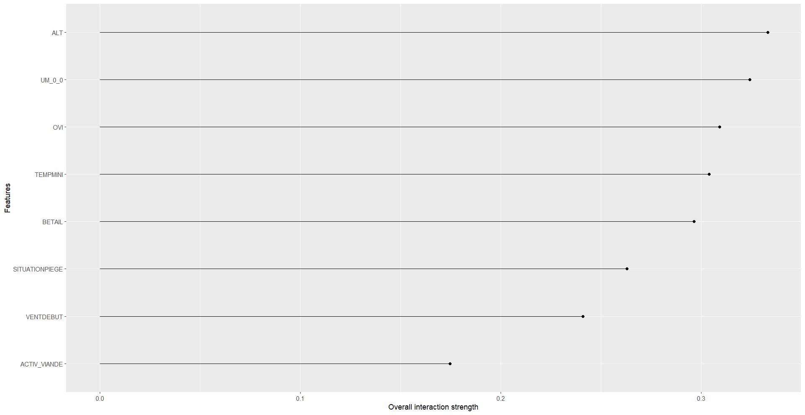
    
We can further investigate how much one specific variable (Altitude) interacts with all other features in a pairwise comparison
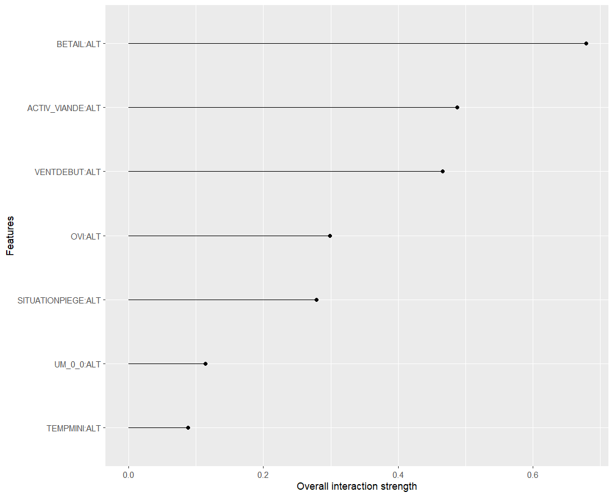

The specific relationship between two strongly interacting features can be visualised with a **2D Partial Dependence Plot**:
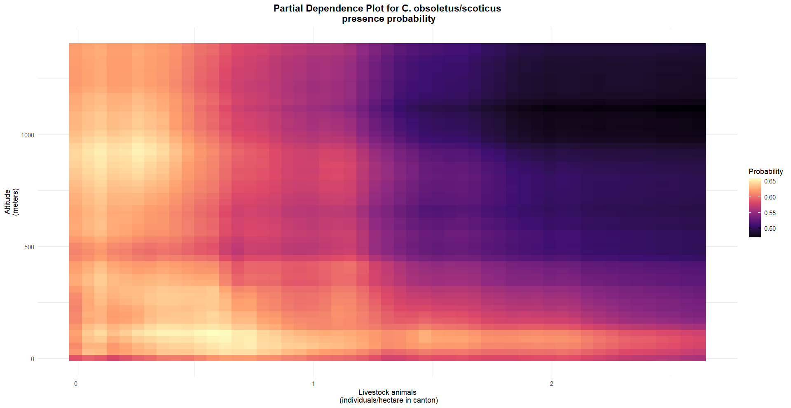

## Roadmap of the **Culicoides project**

### **Backround**
- **Bibliography**
    - Culicoides in France since 2006
        - What trends were seen?
        - How were BTV and EHF introduced?
    - 2008 outbreak and 2015 reintroduction of arboviruses
        - Economic losses, current approaches to reduce spread
- Literature review of studies
    - Studies conducted so far
        - 2009-2012 period for France
        - 2015-2023 period for France
        - Foreign studies
    - Relation to Climate change
    - Challenges for studying *Culicoides*
        - Lifestyle related (cannot conduct lab experiments)
    - Findings so far
        - Species
        - Serotypes
        - Distribution
    - Current predictive models

### **Problematic**
- Current models not sufficient
    - Lack of robustness?
    - Low accuracy?
- Current projects/approaches to improve prediction/surveillance
- Alternative approaches
    - intro into ML

### **Relevance of this project**
- other projects with ML that have shown success (*Aedes spp*.)
- Could provide new information about environmental variables for epidemiological data and surveillance tactics:
    - will extract knowledge about variables at the very least, at most can predict

### **Methods**
- Data Exploration
    - Plots for visualising data distribution
        - Heatmaps
        - Histograms
        - Time series
    - Correlation maps
    - Feature weight plots
- VectorNet archives for new data
- Variable selection
- Model construction

### **Results**
- Describe temporal and spatial distribution of culicoides
- Data driven instead of knoweldge based - VectorNet data

### **Questions**
- Ecological determinants in culicoides pop. distribution?
- What contributed to BTV + EHD reemergence? Due to Culicoides population changes or introduction of new serotypes of virus?
- Why is there heterogeneity in distribution in ***local*** small scale?
- Do the ML models make sense in ecological and epidemiological terms?
- Am I predicting *Culicoides* complex distribution OR specific species?
- regions or times when the predictions work less well (AOA)

----

## Contributing

## Authors and acknowledgment

## Project status

