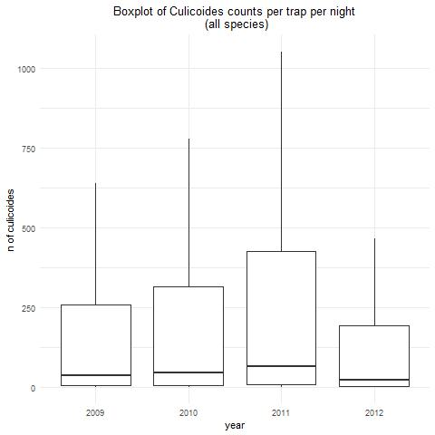
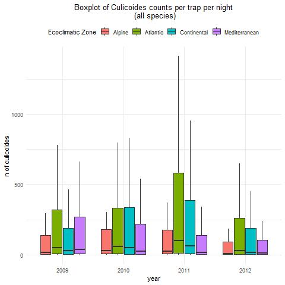
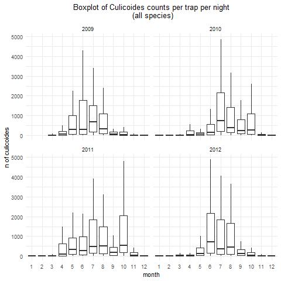
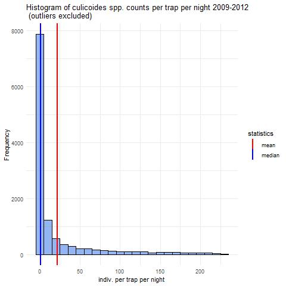
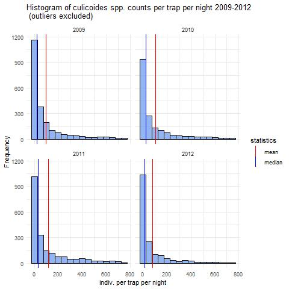
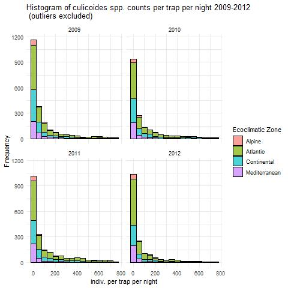

# _Culicoides_ML_

# 2025 Internship subject: **Spatio-temporal modeling of Culidcoides populations in France using Machine Learning**

## Scripts
- `covariates_jeuxdedonnees.R`
    **Rstudio script for primary data preprocessing and some basic visualisation**
- `spatial_covariates.R`
    **Rstudio script for spatial data visualisation + some boxplots (need to transfer them to covariates_jeuxdedonnees script)**
## Description

## Visuals
### Boxplots

-----------------------------------

-----------------------------------
### Histograms

-----------------------------------
### Timeseries

#### Various ways to present the same data

-----------------------------------
### Maps

## Roadmap

## Contributing

## Authors and acknowledgment

## Project status

