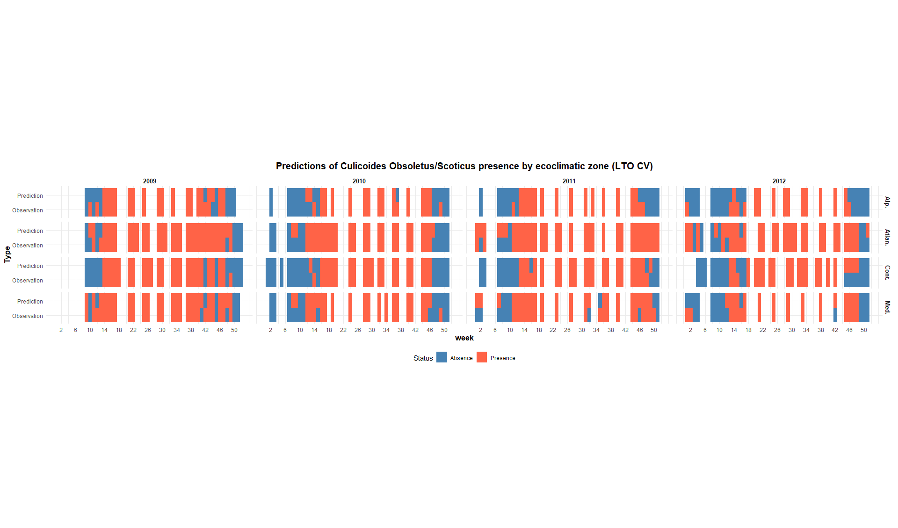
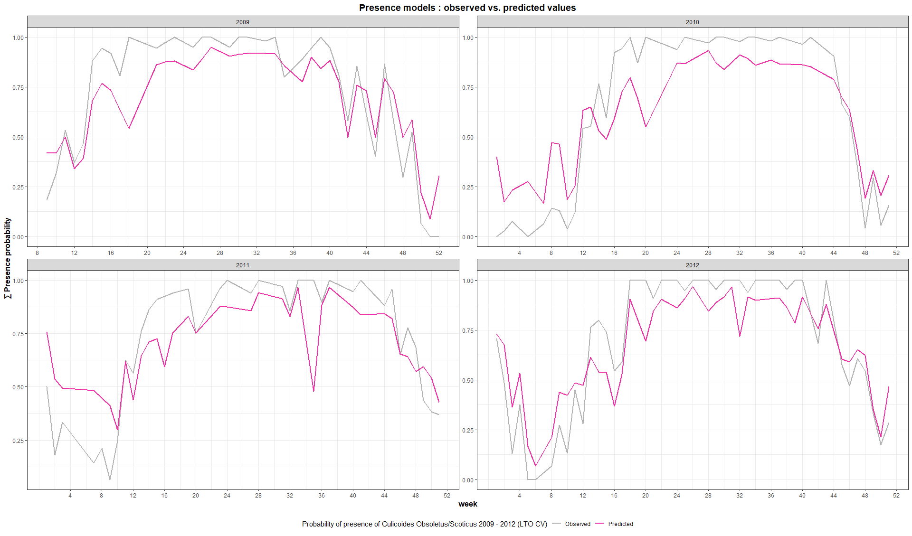
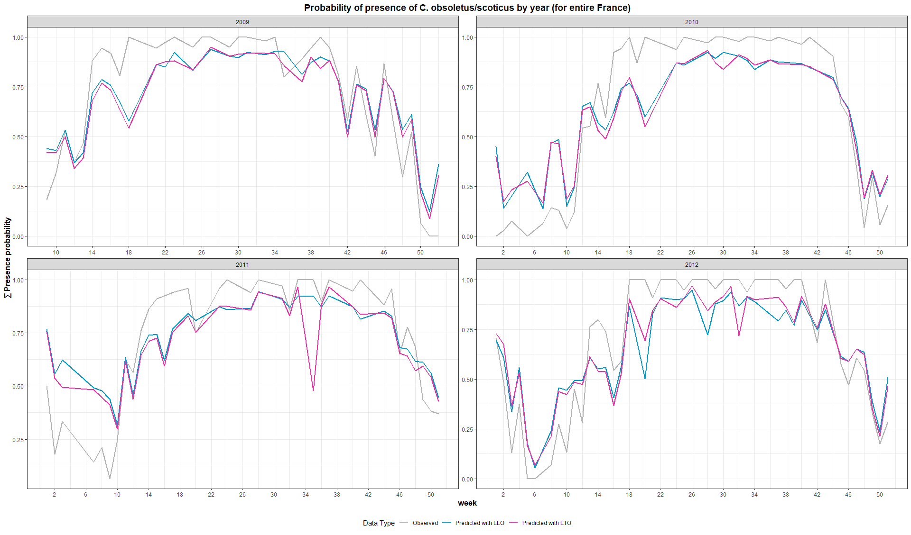
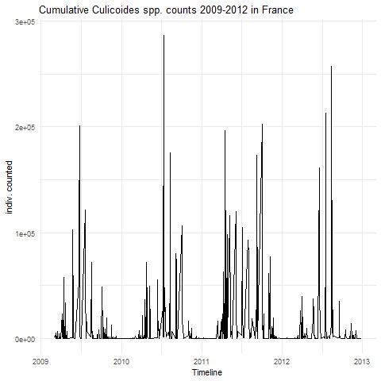
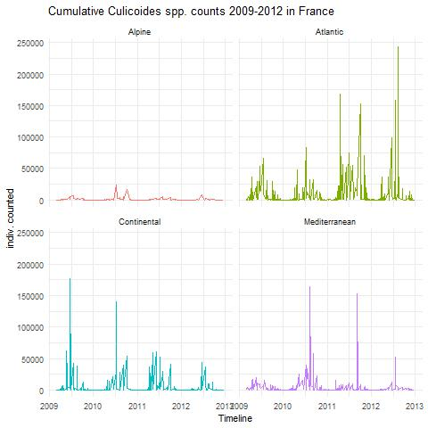
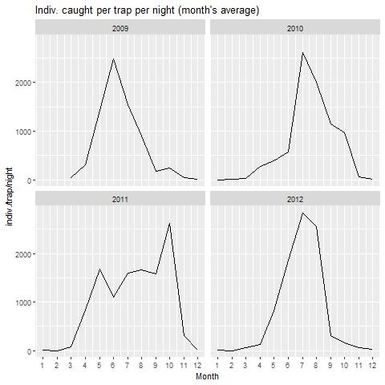
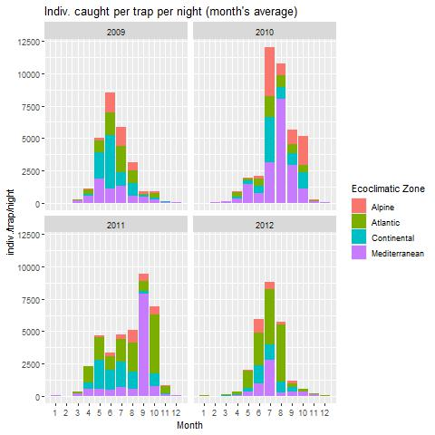

# _Culicoides_ML_

# 2025 Internship subject: **Spatio-temporal modeling of Culidcoides populations in France using Machine Learning**

## INFORMATION
- `/updated_scripts`
    **Directory containing UPDATED work: scripts, model outputs and interpretation**
- `/scripts`
    **Directory containing NOT UPDATED scripts for data preparation, Cross-Correlation Mapping and multivariate analysis**
- `/datapaper_viz`
    **Directory containing ocapi database basic visualizations (histograms, boxplots)**
## Description
The primary goal is to create presence and absence models with two uses:
1) Prediction of Culicoides populations in France in the past, present and future using available climatic data
2) Interpretation and explanation of the model outputs : why were specific areas experiencing high biting midge abundance? Which factors lead to an earlier start of the *Culicoides sp.* activity season?
## Visuals
**
 <mark>1. Presence model output</mark>** 

        C. obsoletus/scoticus predicted vs observed presence 2009-2012 with Leave-Time-Out (LTO) Cross Validation

        With Ecolimatic zones
 C. obsoletus/scoticus predicted vs observed presence 2009-2012 with Leave-Time-Out (LTO) Cross Validation

-----------------------------------
         C. obsoletus/scoticus predicted presence probability 2009-2012 with LTO CV

        Comparing Leave-Location-Out and Leave-Time-Out CV predictions

-----------------------------------
**
 <mark>2. Evaluation </mark>** 

<!-- 
        Histogram of Culicoides spp. counts per trap per night 2009-2012 with mean and median

        With separate years

        With separate years and Ecoclimatic zones

-----------------------------------
**
 <mark>3. Timeseries</mark>** 

        Temporal changes of TOTAL daily counts of Culidoides spp. per each sampling day

        With Ecoclimatic Zones

----------------------------------
        Temporal changes of mean daily counts of Culidoides spp. per trap per each sampling day

----------------------------------
**
Various ways to present the same data** 

        Standardized counts of Culidoides spp. per trap per each sampling day (month's mean)

         With Ecoclmatic Zone

        Same data but separated by Ecoclimatic Zone and represented with bars

         Barcharts with Ecoclimatic zone

-----------------------------------
**
 <mark>4. Maps</mark>** 
 -->

        Culicoides counts across France during different years visualised in a map

----------------------------------
## Roadmap of the **Culicoides project**

### **Backround**
- **Bibliography**
    - Culicoides in France since 2006
        - What trends were seen?
        - How were BTV and EHF introduced?
    - 2008 outbreak and 2015 reintroduction of arboviruses
        - Economic losses, current approaches to reduce spread
- Literature review of studies
    - Studies conducted so far
        - 2009-2012 period for France
        - 2015-2023 period for France
        - Foreign studies
    - Relation to Climate change
    - Challenges for studying *Culicoides*
        - Lifestyle related (cannot conduct lab experiments)
    - Findings so far
        - Species
        - Serotypes
        - Distribution
    - Current predictive models

### **Problematic**
- Current models not sufficient
    - Lack of robustness?
    - Low accuracy?
- Current projects/approaches to improve prediction/surveillance
- Alternative approaches
    - intro into ML

### **Relevance of this project**
- other projects with ML that have shown success (*Aedes spp*.)
- Could provide new information about environmental variables for epidemiological data and surveillance tactics:
    - will extract knowledge about variables at the very least, at most can predict

### **Methods**
- Data Exploration
    - Plots for visualising data distribution
        - Heatmaps
        - Histograms
        - Time series
    - Correlation maps
    - Feature weight plots
- VectorNet archives for new data
- Variable selection
- Model construction

### **Results**
- Describe temporal and spatial distribution of culicoides
- Data driven instead of knoweldge based - VectorNet data

### **Questions**
- Ecological determinants in culicoides pop. distribution?
- What contributed to BTV + EHD reemergence? Due to Culicoides population changes or introduction of new serotypes of virus?
- Why is there heterogeneity in distribution in ***local*** small scale?
- Do the ML models make sense in ecological and epidemiological terms?
- Am I predicting *Culicoides* complex distribution OR specific species?
- regions or times when the predictions work less well (AOA)

----

## Contributing

## Authors and acknowledgment

## Project status

